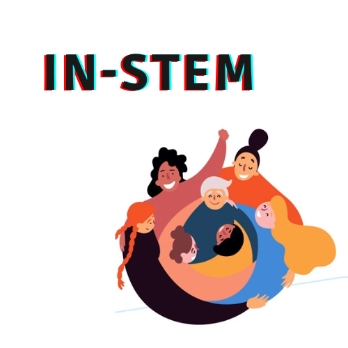

<h1 align="center">
  
 in-STEM  

</h2>

<h3 align="center">
  
 Projeto final da {reprograma}. 
  O in-STEM possui a finalidade de propagar a capacitação e
  a inserção de mais mulheres nas áreas de STEM.

</h4>

## contexto | objetivo
A UNESCO E A ONU apresentaram dados que mostram que em áreas como ciência, o número de pesquisadoras é de 30%, além disso, é possível observar a persistência de barreiras e baixa representatividade em áreas como matemática, ciência, engenharia e tecnologia. Essas últimas palavras constituem nada menos que a palavra STEM em inglês. Estima-se que apenas uma mulher para cada quatro homens, consiga um emprego na área de STEM e isso se dá por causa de fatores sociais, ausência de informação e sexismo. Visando mudar esse cenário, é necessário projetos e iniciativas que visem promover uma maior diversificação nesses campos. Com isso em mente, o inSteam foi criado como uma API que se conecta à um banco de dados sendo possível a postagem de vagas e cursos relacionados.

### funcionamento:
 - Empresas e usuárias poderão se cadastrar e postar vagas de emprego e cursos.
 - Somente usuárias autenticadas e autorizadas poderão visualizar, criar, atualizar e excluir vagas
 - Somentes empresas autenticadas e autorizadas poderão visualizar, criar, atualizar e excluir cursos

 ## ROTAS :globe_with_meridians:
#### CURSOS

 | MÉTODO | ROTA|                                                           | 
 ---------|---------------|--------------------------------------|
|GET      | /cursos       | retorna todos os cursos              |
|GET      | /cursos/:id   | retorna curso pelo id
|GET      | /cursos/buscar/categoria | retorna cursos por categoria |
|GET      | /cursos/buscar/abertos| retorna cursos com inscrições abertas|
|POST     | /cursos       | cadastra um novo curso               |
|PATCH    | /curso/:id    | altera um curso                      |
|DELETE   |/curso/:id      | exclui um curso específico                |
 |

#### VAGAS

 | MÉTODO | ROTA|                                     | 
 ---------|---------------|---------------------------|
|GET      | /vagas        | retorna todas as vagas    |
|GET      | /vaga/:id     | retorna vaga pelo id            |
|GET      | /vaga/buscar/area| retorna vagas por categoria  |
|GET      | /vaga/buscar/disponibilidade| retorna vagas disponíveis |
|POST     | /vaga         | cadastra nova vaga              |
|PATCH    | /vaga/:id     | altera dados de uma vaga        |
|DELETE   | /vaga/:id     | exclui uma vaga                 |

#### USERS

 | MÉTODO | ROTA|         | 
 ---------|---------------|---------------------------------|
|POST     | /register     | cadastra novo user              |
|POST     | /login        | login                           |
|GET      | /users        | retorna todos users cadastrados |
|DELETE   | /user/:id     | excluir um user cadastrado      |

## tecnologias utilizadas

- [ ] Node.js
- [ ] MongoDB Atlas
- [ ] express
- [ ] mongoose
- [ ] dotenv
- [ ] bcrypt
- [ ] jsonwebtoken
- [ ] cors
- [ ] swagger
- [ ] eslint
- [ ] Jest
- [ ] Heroku
- [ ] Git

## Documentação

 A documentação pode ser acessada [aqui](https://in-stem.herokuapp.com/minha-rota-de-documentacao)

----------------------------

A aplicação está disponível [aqui](https://in-stem.herokuapp.com/)

Desenvolvido com   :heart:

